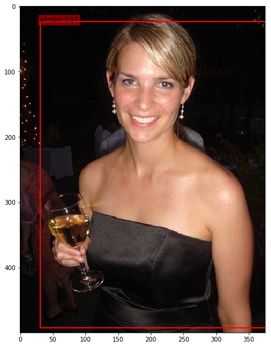
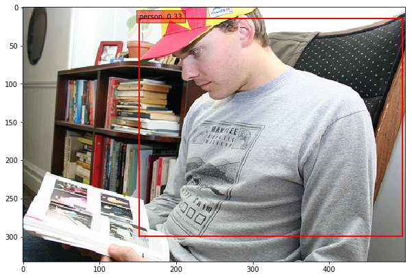

# BlazeFace_person_pytorch
blazeface trained on pascal_voc person.

The training and inference is about 10x faster than SSD.

The BlazeFace model is based on https://github.com/tkat0/PyTorch_BlazeFace, and localaization and detection layers are added from ssd.pytorch.

## requirements
Pytorch > 1.0
opencv

# how to train
`python train_with_blazeface`

See Dataset_test_with_BlazeFace.ipynb for specifics.

